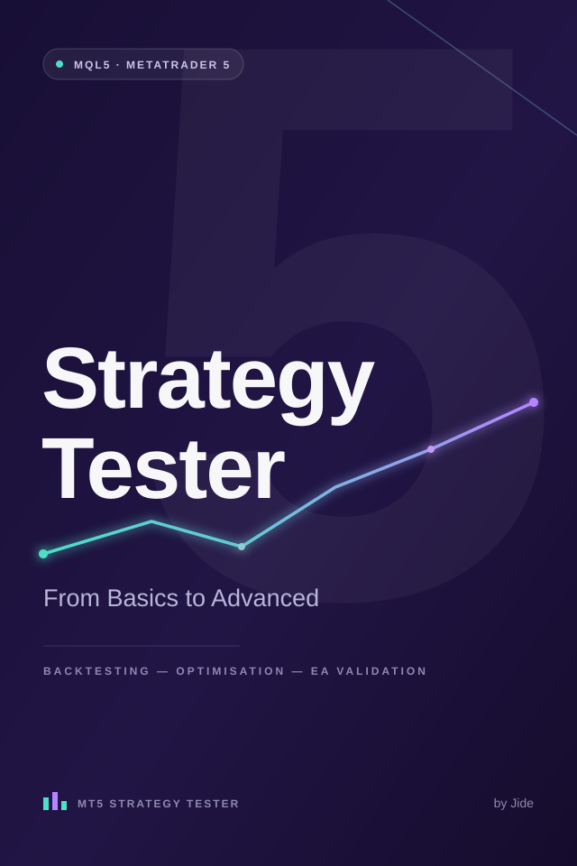

# Automated System Validation Examples

<p align="center">
  
</p>

<p align="center">
  Companion examples for the technical book:
  <br>
  <strong>MetaTrader 5 Strategy Tester: From Basics to Advanced</strong>
</p>

---

# Overview

This repository contains practical examples demonstrating automated system validation techniques applied to complex, event-driven systems.

The project explores how software engineering and quality engineering principles can be applied to the validation of automated systems, using MetaTrader 5 Expert Advisor examples as a practical execution environment.

The focus is on:

- Test strategy and validation methodology
- Automated system behaviour verification
- Test scenario design
- Backtesting workflows
- Parameter validation
- Optimisation analysis
- Regression testing approaches
- Robustness testing
- Risk control validation

The repository contains compiled MetaTrader 5 Expert Advisor (`.ex5`) examples that can be executed within the MetaTrader 5 Strategy Tester environment.

The examples are provided for educational and technical demonstration purposes.

---

# Project Scope

**Independent Automation Engineering & Technical Authoring Project**  
**Jun 2025 – Present**

This project represents an independent engineering and technical writing initiative focused on automated system validation.

The work includes:

- Researching automated system testing methodologies
- Designing practical validation examples
- Developing automated system implementations
- Creating structured test scenarios
- Documenting testing approaches
- Analysing system behaviour under different conditions
- Producing technical documentation for knowledge sharing

The emphasis is on engineering practices used to validate automated systems rather than developing trading strategies.

---

# Engineering Activities

The project demonstrates activities commonly associated with software quality engineering:

- Requirements analysis and definition of expected behaviour
- Test scenario design
- Automated validation workflows
- Configuration and parameter testing
- Boundary testing
- Regression analysis
- Robustness evaluation
- Failure scenario investigation
- Technical documentation
- Knowledge transfer through technical writing

---

# Repository Structure

```
automated-system-validation-examples/

│
├── README.md
│
├── images/
│   └── book-cover.png
│
├── Expert Advisors/
│   │
│   ├── EA_01_TrendFollowing/
│   │   └── TrendFollowing.ex5
│   │
│   ├── EA_02_MeanReversion/
│   │   └── MeanReversion.ex5
│   │
│   ├── EA_03_Breakout/
│   │   └── Breakout.ex5
│   │
│   └── EA_04_RiskManagement/
│       └── RiskManagement.ex5
│
├── Test Cases/
│   └── validation-scenarios.md
│
└── Documentation/
    │
    ├── testing-approach.md
    ├── validation-strategy.md
    ├── optimisation-analysis.md
    └── risk-controls.md
```

---

# Testing Techniques Demonstrated

## Functional Testing

Validates that the automated system behaves according to defined requirements and expected outcomes.

Examples:

- Entry condition validation
- Exit condition validation
- Workflow verification
- System behaviour checks
- Configuration validation

---

## Boundary Testing

Validates system behaviour at configuration limits and unusual input conditions.

Examples:

- Minimum and maximum parameter values
- Invalid configuration scenarios
- Risk threshold limits
- Position sizing boundaries

---

## Regression Testing

Ensures system behaviour remains consistent following changes.

Examples:

- Re-executing previous scenarios
- Comparing historical results
- Detecting unexpected behaviour changes
- Maintaining repeatable validation processes

---

## Data-Driven Testing

Evaluates system behaviour using different input combinations.

Examples:

- Different datasets
- Different execution periods
- Different configurations
- Different environmental conditions

---

## Robustness Testing

Evaluates system reliability under changing conditions.

Examples:

- Parameter sensitivity analysis
- Historical scenario comparison
- Stress conditions
- Behaviour consistency evaluation

---

## Risk Control Validation

Validates protective mechanisms and system safeguards.

Examples:

- Stop-loss controls
- Position sizing rules
- Exposure limits
- Drawdown controls
- Safety restrictions

---

# Validation Workflow

The project follows a structured validation lifecycle:

```
Define Expected Behaviour

          |

          v

Design Test Scenarios

          |

          v

Configure Test Environment

          |

          v

Execute Automated Validation

          |

          v

Analyse Results

          |

          v

Investigate Failures

          |

          v

Revalidate Improvements
```

---

# Example Systems

## EA 01 - Trend Following Validation Example

Demonstrates:

- Automated decision logic
- Configuration-driven behaviour
- Historical validation workflows
- Result analysis

---

## EA 02 - Mean Reversion Validation Example

Demonstrates:

- Alternative system behaviour
- Parameter variation testing
- Scenario comparison
- Validation techniques

---

## EA 03 - Breakout Validation Example

Demonstrates:

- Event-driven system behaviour
- Rule-based execution
- Robustness evaluation

---

## EA 04 - Risk Management Validation Example

Demonstrates:

- Protective controls
- Risk parameter validation
- Failure condition handling
- System safeguards

---

# Backtesting as a Validation Technique

The MetaTrader 5 Strategy Tester is used as an execution environment for evaluating automated system behaviour.

Validation activities include:

- Historical scenario execution
- Behaviour verification
- Configuration comparison
- Regression analysis
- Performance analysis

Backtesting is treated as one component of a wider validation process.

A successful historical result alone does not guarantee future performance.

---

# Optimisation Analysis

The examples demonstrate optimisation concepts including:

- Parameter variation
- Configuration comparison
- Sensitivity analysis
- Result interpretation

Optimisation should be supported by robust validation practices to reduce the risk of overfitting.

---

# Book Structure

This repository provides practical examples supporting:

**MetaTrader 5 Strategy Tester: From Basics to Advanced**

The book covers:

## Chapter 1 — Automated System Validation Fundamentals

Topics:

- Automated systems overview
- Validation objectives
- Testing principles

---

## Chapter 2 — Testing Environment and Configuration

Topics:

- Strategy Tester overview
- Execution configuration
- Test setup

---

## Chapter 3 — Designing Testable Automated Systems

Topics:

- Configuration management
- Repeatable execution
- Testability principles

---

## Chapter 4 — Backtesting Methodology

Topics:

- Historical testing workflows
- Scenario design
- Result analysis

---

## Chapter 5 — Optimisation Techniques

Topics:

- Parameter optimisation
- Sensitivity analysis
- Avoiding overfitting

---

## Chapter 6 — Validation and Robustness Testing

Topics:

- Scenario validation
- Reliability analysis
- Consistency evaluation

---

## Chapter 7 — Risk Management Validation

Topics:

- Risk controls
- Exposure management
- Protective mechanisms

---

## Chapter 8 — Building Reliable Automated Systems

Topics:

- Continuous improvement
- Monitoring considerations
- Engineering practices

---

# Installation

## Requirements

- MetaTrader 5 Desktop Platform
- Historical market data
- Compatible testing environment

---

## Installing Expert Advisors

1. Open MetaTrader 5.

2. Select:

```
File → Open Data Folder
```

3. Navigate to:

```
MQL5/Experts
```

4. Copy the `.ex5` file into the directory.

5. Restart MetaTrader 5.

6. Open Navigator.

7. Attach the Expert Advisor to a chart.

---

# Technical Skills Demonstrated

This project demonstrates experience with:

- Automated system validation
- Test strategy design
- Regression testing
- Risk-based testing
- Data-driven validation
- Technical documentation
- Quality engineering principles
- Complex system analysis

---

# Disclaimer

These examples are provided for educational and technical demonstration purposes only.

They demonstrate software engineering, testing and validation approaches applied to automated systems.

They are not financial advice, trading recommendations or guarantees of future performance.

---

# About

**JFSoftwareServices**

Engineering resources covering:

- Test Automation Architecture
- Quality Engineering
- API and System Validation
- Automation Framework Design
- Automated System Testing

GitHub:

https://github.com/JFSoftwareServices
